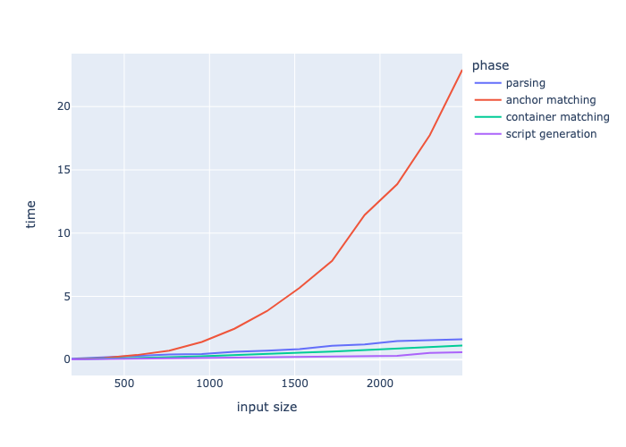
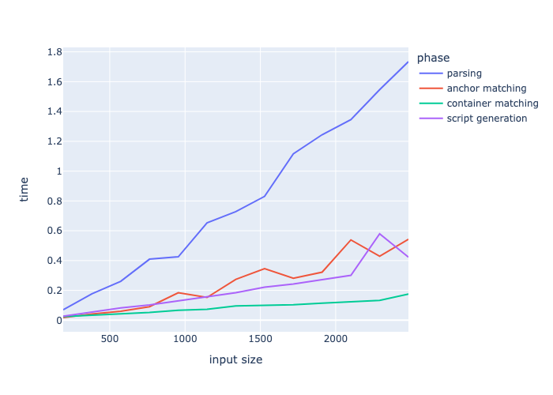
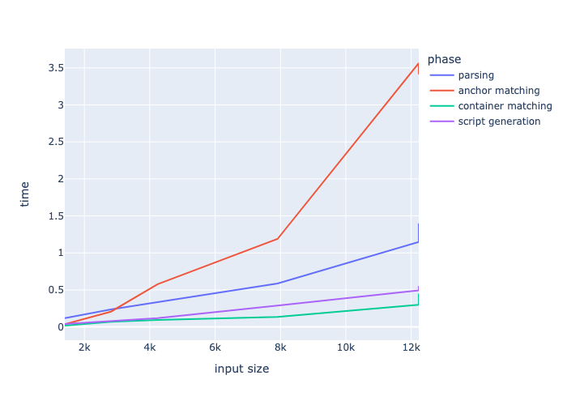
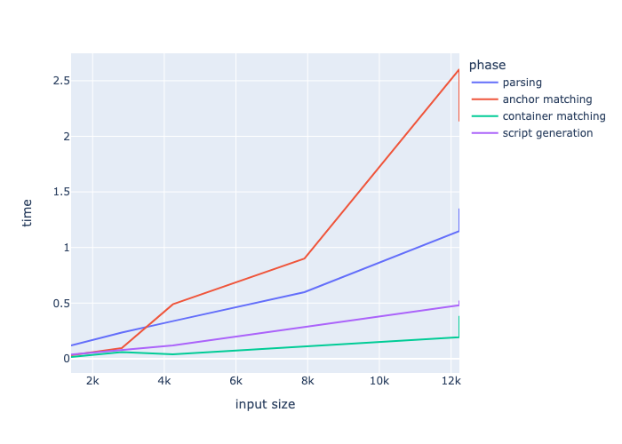

# Testausdokumentti

[](https://codecov.io/gh/henrinikku/ast-diff)

## Miten testataan

Projektin automaattinen testaus perustuu kattaviin yksikkötesteihin. Kaikkiaan testejä on kolmenlaisia:

- Yksikkötestit
- Integraatiotestit
- Suorituskykytestit

Suurin osa testeistä on toteutettu `pytest`-kirjaston avulla, ja pari yksittäistä testiä Pythonin oletus `unittest`-kirjaston avulla. Pytest-runner kykenee tunnistamaan ja ajamaan kaikki testit.

## Yksikkötestit

Suurin osa projektin testeistä on yksikkötestejä, joita on kirjoitettu käytännössä kaikille luokille/metodeille erikseen pieniä poikkeuksia lukuunottamatta.

## Integraatiotestit

Projektin integraatiotestit eivät teknisesti eroa yksikkötesteistä, mutta ne testaavat ohjelmaa kokonaisuutena. Integraatiotestit on toteutettu Typer-kirjaston [1] tarjoaman `CliRunner` luokan avulla, joka mahdollistaa ohjelman komentorivikäyttöliittymän kutsumisen testien sisältä.

## Suorituskykytestit

Suorituskykytestien ajamiseen menee tällä hetkellä pari minuuttia ja ne tulostavat seuraavanlaisen raportin:

```
------------------------------------------------------------------------------------------------------------------------- benchmark: 11 tests --------------------------------------------------------------------------------------------------------------------------
Name (time in us)                                                 Min                        Max                       Mean                    StdDev                     Median                       IQR            Outliers         OPS            Rounds  Iterations
------------------------------------------------------------------------------------------------------------------------------------------------------------------------------------------------------------------------------------------------------------------------
test_anchor_matching_performance                             178.3100 (1.0)             395.2130 (1.0)             202.8867 (1.0)             35.5314 (1.05)            192.2400 (1.0)             17.7660 (1.0)           9;9  4,928.8601 (1.0)         100           1
test_container_matching_performance                          382.7720 (2.15)            568.5090 (1.44)            412.9437 (2.04)            33.8719 (1.0)             397.9895 (2.07)            29.6205 (1.67)         12;8  2,421.6378 (0.49)        100           1
test_metadata_calculation_performance_200_lines            5,175.2650 (29.02)         7,530.2430 (19.05)         5,551.6956 (27.36)          454.5685 (13.42)         5,429.7365 (28.24)          220.9445 (12.44)         3;4    180.1252 (0.04)         32           1
test_edit_script_generation_performance_200_lines         32,519.7460 (182.38)       79,806.0340 (201.93)       39,191.0121 (193.17)      14,408.8891 (425.39)       34,269.8650 (178.27)       2,605.5130 (146.66)        1;1     25.5161 (0.01)         10           1
test_gumtree_performance_200_lines                       106,727.6950 (598.55)      116,382.8880 (294.48)      110,518.8744 (544.73)       3,197.4903 (94.40)       109,839.9380 (571.37)       3,980.1450 (224.03)        4;0      9.0482 (0.00)         10           1
test_metadata_calculation_performance_2k_lines           107,346.4180 (602.02)      112,758.5760 (285.31)      109,511.3779 (539.77)       2,071.3354 (61.15)       109,757.4080 (570.94)       3,366.4297 (189.49)        2;0      9.1315 (0.00)          7           1
test_diff_performance_200_lines                          142,310.3220 (798.11)      143,907.4310 (364.13)      143,309.1133 (706.35)         870.6168 (25.70)       143,709.5870 (747.55)       1,197.8317 (67.42)         1;0      6.9779 (0.00)          3           1
test_edit_script_generation_performance_2k_lines         420,099.6160 (>1000.0)     434,319.7990 (>1000.0)     425,216.0223 (>1000.0)      7,904.2864 (233.36)      421,228.6520 (>1000.0)     10,665.1372 (600.31)        1;0      2.3517 (0.00)          3           1
test_gumtree_performance_2k_lines                        898,265.3790 (>1000.0)   1,102,243.9100 (>1000.0)     985,670.1050 (>1000.0)    105,071.1029 (>1000.0)     956,501.0260 (>1000.0)    152,983.8983 (>1000.0)       1;0      1.0145 (0.00)          3           1
test_diff_performance_2k_lines                         1,437,303.7100 (>1000.0)   1,589,265.1730 (>1000.0)   1,514,580.5757 (>1000.0)     76,013.8898 (>1000.0)   1,517,172.8440 (>1000.0)    113,971.0972 (>1000.0)       1;0      0.6602 (0.00)          3           1
test_diff_performance_django_code_8k_lines            25,932,371.1940 (>1000.0)  27,854,140.0070 (>1000.0)  27,134,876.7127 (>1000.0)  1,048,065.4217 (>1000.0)  27,618,118.9370 (>1000.0)  1,441,326.6097 (>1000.0)       1;0      0.0369 (0.00)          3           1
------------------------------------------------------------------------------------------------------------------------------------------------------------------------------------------------------------------------------------------------------------------------
```

Suoritusajat on ilmoitettu raportissa mikrosekunteina, eli esimerkiksi 5000 ja 8000 rivin tiedostojen vertailuun kuluu omalla MacBookillani aikaa noin 27 sekuntia.

Algoritmin eri vaiheiden erikokoisilla syötteillä vaatimaa aikaa esittävän kuvaajan saa luotua ajamalla projektin juurikansiossa esim.

```
poetry run plotruntime --export-path kuvaaja.png
```

## Testisyötteet

Koska mahdollisia syntaksipuita on monenlaisia ja lopputulos riippuu paljon myös käytetystä parsintakirjastosta, useissa yksikkötesteissä käytetään syötteenä GumTree-paperissa [2] havainnollistavana esimerkkinä käytettyä, Java-kielen syntaksia kuvaavaa puuta. Lisäksi yksikkötesteissä käytetään syötteinä myös itse kirjoittamiani Python-koodinpätkiä. Itsetehdyt syötteet on täytynyt pitää melko pieninä, koska syntaksipuista tulee helposti melko suuria ja algoritmin toiminnan (ja siten odotetun lopputuloksen) järkeily on suhteellisen vaivalloista.

Suorituskykytestauksen syötteinä käytetään joidenkin Django-projektin [3] tiedostojen eri versioita.

Testeihin kovakoodattuja koodipätkiä lukuunottamatta kaikki testisyötteet löytyvät [tests/data](../tests/data/) -kansiosta.

## Testien suorittaminen

Yksikkö- ja integraatiotestit saa suoritettua ajamalla projektin juurikansiossa:

```
poetry run pytest
```

Suorituskykytestejä ei ajeta oletuksena, sillä niissä menee muita testejä huomattavasti enemmän aikaa. Suorituskykytestit saa suoritettua seuraavalla komennolla:

```
poetry run pytest --benchmark-only
```

## Testikattavuus

Testikattavuusraportti päivittyy automaattisesti codecov-palveluun, ja codecov-badge löytyy tämän dokumentin sekä README:n ylälaidasta.

Testien kattavuuden saa mitattua manuaalisesti ajamalla projektin juurikansiossa:

```
poetry run coverage run
```

Vastaavasti kattavuusraportin saa tulostettua ajamalla:

```
poetry run coverage report
```

Testikattavuus on raportin perusteella tällä hetkellä melko hyvällä tolalla:

```
Name                               Stmts   Miss Branch BrPart  Cover   Missing
------------------------------------------------------------------------------
astdiff/__init__.py                    0      0      0      0   100%
astdiff/ast/metadata.py               35      0     18      0   100%
astdiff/ast/node.py                   54      0     12      1    98%   58->exit
astdiff/ast/traversal.py              20      0      6      0   100%
astdiff/context.py                    75      3     24      2    95%   26, 103, 112
astdiff/differ.py                     27      0      0      0   100%
astdiff/editscript/__init__.py         5      0      2      0   100%
astdiff/editscript/ops.py             48      1     14      0    98%   24
astdiff/generator/__init__.py          0      0      0      0   100%
astdiff/generator/base.py              9      1      0      0    89%   18
astdiff/generator/factory.py           9      0      2      1    91%   22->exit
astdiff/generator/with_move.py        79      0     36      2    98%   154->160, 157->154
astdiff/main.py                       25      1      2      1    93%   58
astdiff/matcher/__init__.py            0      0      0      0   100%
astdiff/matcher/base.py               14      1      0      0    93%   16
astdiff/matcher/factory.py            15      0      6      1    95%   26->exit
astdiff/matcher/gumtree.py           148      3     90      2    98%   190-194, 228
astdiff/matcher/gumtree_utils.py      33      0     10      0   100%
astdiff/parser/__init__.py             0      0      0      0   100%
astdiff/parser/base.py                36      2      6      0    95%   70, 78
astdiff/parser/builtin.py             23      0      6      0   100%
astdiff/parser/factory.py             13      0      4      1    94%   24->exit
astdiff/parser/parso.py               31      0     10      0   100%
astdiff/util.py                       49      0     20      0   100%
------------------------------------------------------------------------------
TOTAL                                748     12    268     11    98%
```

## Suorituskykytestauksen tuloksia

### Kopioimalla muodostetut syötteet

Ohjelman eri vaiheiden suorituskykyä testatessa kävi ilmi, että algoritmin ns. anchor matching (eli ensimmäinen) vaihe muodostaa merkittävän pullonkaulan syötteillä, joissa sama pitkähkö koodinpätkä toistuu monta kertaa peräkkäin. Tämä käy järkeen, sillä löytäessään useita keskenään isomorfisia alipuita algoritmi joutuu laskemaan kahden puun samankaltaisuutta mittaavan dice-kertoimen jokaiselle näiden puiden karteesisesta tulosta muodostuvalle parille selvittääkseen parhaan mahdollisen matchin. Dice-kertoimen laskeminen taas on suhteellisen kallis operaatio näin monta kertaa suoritettavaksi.



Onneksi Dice-kertoimen laskennan tulosten talletus ja uudelleenkäyttö ([249bc3de](https://github.com/henrinikku/ast-diff/commit/249bc3dea0200290f5b043aeb7fedb72285e4781)) eliminoi pullonkaulan täysin. Muutoksen myötä algoritmi toimii kymmeniä kertoja nopeammin mainitun kaltaisilla syötteillä.



### Käsin valitut syötteet

Anchor matching -vaihe vei odotetusten mukaisesti suurimman osan ajasta myös käsin valituilla Django-projektin [3] tiedostoilla testattaessa. Huom: alla syötteen koko merkitsee lähdetiedoston rivimäärän sijaan syntaksipuun solmujen lukumäärää.



Hieman yllättäen Dice-kertoimen cachetus paransi suorituskykyä jonkin verran myös tässä tapauksessa, vaikka tiedostoissa ei ole (ainakaan tarkoituksella) kovin paljoa toisteisuutta.



## Viitteet

- [1] https://github.com/tiangolo/typer
- [2] https://hal.archives-ouvertes.fr/hal-01054552/document
- [3] https://github.com/django/django
